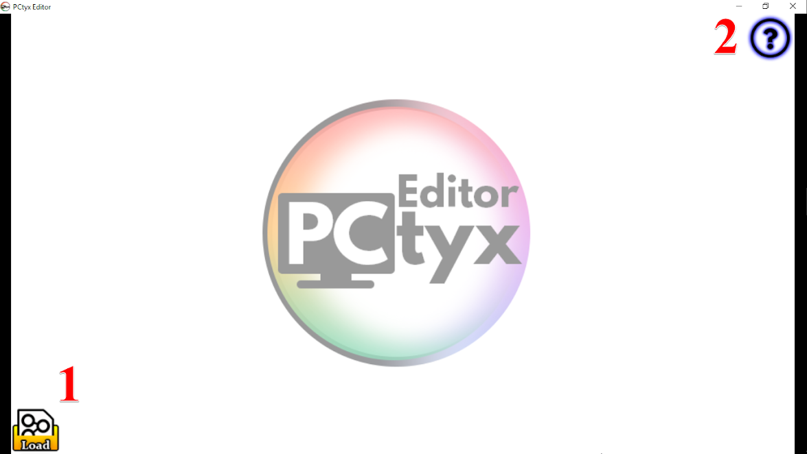
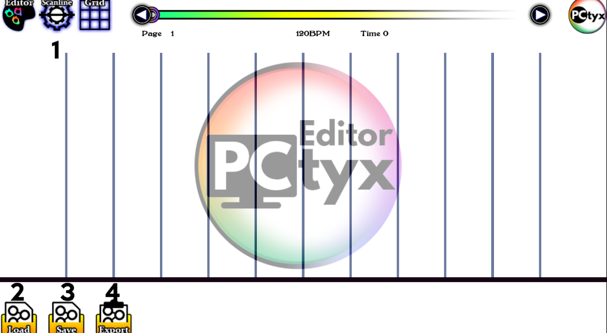

# PCTyx

PCTyx是JCEXE制作的制谱程序。作为Project Thrynox的继任者。该指南已针对C2格式标准进行了更新。

这是对PCTyx图表的介绍。CrowFX（某些部分已过时）提供了更为详细和更简单的PCTyx指南，您可以在此处查看。

- [用户界面](https://sites.google.com/site/cytoidcommunity/guides/charting/introduction-pctyx/pctyx-user-interface-old)
- [制图](https://sites.google.com/site/cytoidcommunity/guides/charting/introduction-pctyx/pctyx-charting-old)

> 译者:这两个页面因为过时所以没翻译,请自备工具访问

## 用户界面

### I.启动

**1.**加载按钮：打开/继续项目。您必须至少打开支持的音频文件才能开始制图。

 支持的文件格式包括：

​        **a.**音频文件

- .mp3（唯一Cytoid支持的文件类型）
- .M4A
- .OGG

​        **b.** 图表文件

- .csv - 保存图表时，这是您应该获得的文件类型。如果你正在制作一个c2格式的图表，请使用它。
- .cytus.txt - 用于Cytus 1和Cytoid的通用格式

​        **c.**背景视频（可选，不适用于Cytoid）

- .MP4
- .ogv

​        **d.**背景图像（PCtyx中可选，Cytoid上是强制性的）

- .JPG
- .png

**2.**有问题(?)：[http://cytus-fanon.wikia.com/wiki/User_blog](http://cytus-fanon.wikia.com/wiki/User_blog)的超链接。这用于检查PCtyx的最新更新，或向开发人员JCEXE询问/报告错误。

要启动新项目，请单击加载按钮，然后选择图表所需的音频文件。

### II。编辑

####     A）文件选项屏幕 

**1.**扫描线按钮：转到扫描线部分。

**2.**加载：加载您需要的更多文件。

**3.**保存：保存.csv文件。建议您停止制图时，或者如果您要长时间制作图表时每隔一小时保存一次，以防意外发生。如果您使用C2格式绘制图表，则需要.csv才能使转换器正常工作。

**4.**导出：仅在制作c1图表时使用，这会将所有图表数据转换为c1格式(将删除C2特性的note)。

#### B）扫描线屏幕 

**1.**文件：如果需要添加其他文件，请按此键找到第二个屏幕。

**2.**编辑：使用它来转到编辑器。

**3.**网格：使用它来转到网格。

**4.** BPM：扫描线的速度，或歌曲的BPM。在这里插入bpm，但是如果你想让扫描线比原始的bpm更快，我建议只使用x0.5，x1.0，x1.5或x2.0的倍数。可以使用任何其他内容，但请确保扫描线处于同步状态。

**5.** Shift：调整歌曲的偏移量，使扫描线反弹可以匹配歌曲。插入歌曲第一个重要节拍的时间。如果使用偏移量，只需将其设置为0即可。(为保证兼容性,请尽量设置为0)

**6.**偏移：在此处插入偏移量。它与osu!的偏移量相同。如果shift为1.131秒，则偏移量为1131.建议使用shift。

**7.**确认：确认您的更改。

此处未列出：方向

单击它，您应该有3个不同的选项：空白，U / D和D / U. 如果您希望扫描线从顶部开始并在第一页上下移，则选择U / D. 如果您希望扫描线从底部开始，然后在第一页上，请选择D / U. 空白是为了你不在乎的时候，除非你知道你在做什么，否则在大多数情况下将它留空是更好的。

#### C）网格对齐屏幕 

**1.**行：取决于你的BPM，但8和16是4/4图表的好例子。如果您没有正确选择，那么您将很难将note对音。

**2.**列：制谱你想要多少列，18,6,24,12和20是很常用的值。

**3.** BPM：没有意义。

**4.** Shift（网格）：设置为0.001。

#### D）编辑屏幕

**1.**游戏测试：查看您的图表。

**2.**移动y轴：垂直移动note。

**3.**移动x轴：水平移动note。

**4.**点按note：将您的note类型更改为点按，也可用于删除note。

**5.**拖动父note：将note类型更改为拖动note。您可以使用Q分配链接ID以增加ID值，使用E分配ID值以减少ID值。具有相同ID值的拖动将被链接，而不同的拖动将不会链接。

**6.**拖动子note：将note类型更改为拖动子note类型。作品与5相似。

**7.**长按note：将您的note类型更改为长按note类型。使用Q增加保持时间，使用E减少保持时间。您可以使用右键单击和左键单击相同的功能。

**8.**长保留note(不建议)：将您的note类型更改为长保持note。仅适用于c2格式。使用c2类型note时，请务必保存.csv。长按暂停note，但建议使用保留note，因为csv到c2转换器会自动转换超出入站线的任何保留note（或者如果保持包含在一个页面中的时间太长）。

**9.**滑动note：将note类型更改为滑动note。仅适用于c2格式。

**10.**自动对齐：取消选择时，note不会自动对齐到最近的网格。水平移动note时不建议这样做。

**11.**撤销：撤销您对该页面的更改。

**12.**页面导航：拖动小圆圈，您可以使用它来浏览页面。当您在页面中移动1页时，请使用向左箭头和向右箭头。

#### I）放置note，使用保留

可以使用数字8选项首先放置note。单击它或按键盘上的“2”。

- 可以从两侧拖动note以将其作为点按note（note1）。双方的note超出了图表范围，并且不会出现在游戏中。
- 现有note可以水平移动（注4）。按住左键单击按钮的同时拖动note，然后将note移动到所需位置。note上的值显示了note在x轴上的位置。x轴note的可播放范围是x∈[0,1]。

可以使用数字9选项移动note的时间。单击它或按键盘上的“1”。

- 现有note可以垂直移动（注5）。按住左键单击按钮的同时拖动note，然后将note移动到所需位置。note上的值显示note的时间（以秒为单位）。

您可以使用左键单击并右键单击调整播放器保持note的时间。

- 在note4中，您可以使用左键单击（增加）和右键单击（减少）来调整保持时间。您可以添加/删除的保留时间取决于您的网格大小。
- 您可以在键盘上使用“E”，而不是左键单击。您可以使用键盘上的“Q”代替右键单击。这适用于为note分配ID值时的拖动。

要将note更改回点击note，请按键盘上的“3”并单击要还原的note。这会将其更改为点按note。如果您要删除备注，请在备注时单击带有相同选项（3）的备注。

注2和3是拖动父（或拖动头）和拖动子示例的示例。

注6和7仅适用于c2格式的图表。6是长保持（或不能完全包含在页面中的保持（延伸入站线），而note7表示轻弹note。

#### II）拖拉

如果y轴上的一个页面上有多个拖动，想要拖动不连接，当光标在note上时，按Q或E为每个note分配一个“连接值”。具有相同值的那些将被连接或链接，而具有不同值的那些将不会。请注意，子note不能与父母note相关联，但子note可以与子note相关联。这是一个例子：

- **在任何情况下** ID值时，父note1都不能与父note2连接。
- 子note3 **在任何情况下**都不能与父note4连接。
- 父note2：不能与孩子记3连接时的ID值是**不同的**。
- 当ID值**在任何情况下**都相同时**，**子note8和子note9无法连接。如果它们具有相同的ID值，则两个子note**将从**游戏测试中**隐藏**。
- 如果父note1和2以及子注3 ID值相同，这将导致PCtyx中的错误。**请避免这样做**。
- 如果父note4是子票据，并且票据1,3,4共享相同的ID值，则**所有三个note将被链接。**
- 跨页拖动的工作，如果note共享**相同的ID值**和**无拖头都存在**。

  